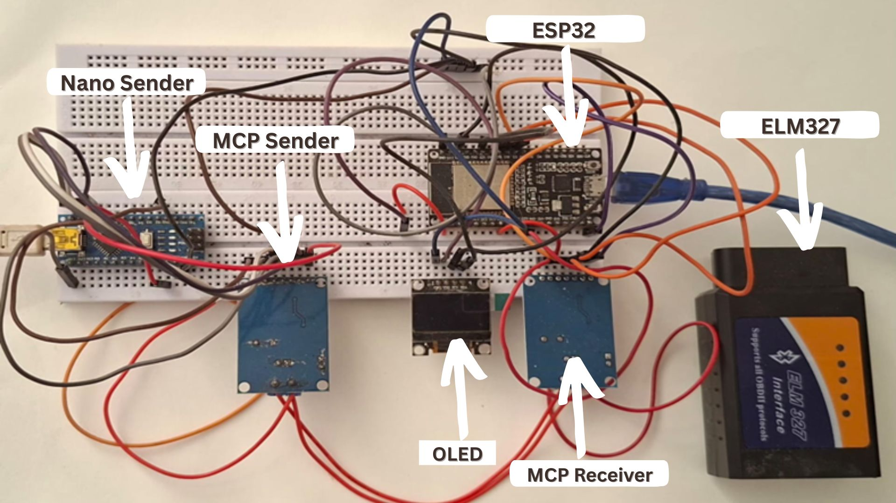

# OBD-II-Port-Telemetry-ADAS-ESP32

Vehicle Telemetry via OBD-II Port: Real-time ECU diagnostics (PIDs/DTCs), CAN bus decoding, Level 0 ADAS alerts on ESP32-S3 OLED. Features ELM327/MCP2515, threshold-based driver warnings, WiFi telemetry.

# 🚗 ESP32 OBD-II CAN Shield

ESP32-S3 based OBD-II telemetry logger with 42-driver dataset

## 📦 What's Included

### Hardware (Manufacturing Files)

- **MCU Board**: ESP32-S3 + TJA1051 CAN + MicroSD + OLED

- **OBDPlug**: 16-pin OBD-II connector

| Board | Gerber | BOM | 3D Model |
|-------|--------|-----|----------|
| MCU Board | [Download](hardware/pcb/MCU/Gerber_PCB_mcu.zip) | [Excel](hardware/pcb/MCU/BOM_ESPBoard_PCB_mcu.xlsx) | [STEP](hardware/pcb/MCU/3D_PCB_mcu.step) |
| OBDPlug | [Download](hardware/pcb/OBDPlug/Gerber_PCB_obdplug.zip) | [Excel](hardware/pcb/OBDPlug/BOM_OBDPlug_PCB_obdplug.xlsx) | [STEP](hardware/pcb/OBDPlug/3D_PCB_obdplug.step) |

### Software

- ESP32 firmware (PlatformIO project)

- Python telemetry receiver

- Complete source code

### Datasets

- **42 drivers** across 3 experiments

- exp1: 14 drivers × 14 cars

- exp2: 19 drivers × 1 car  

- exp3: 4 drivers × 1 car

## 📸 Prototype Photos

## Technical Specs

- ESP32-S3-WROOM module

- TJA1051 CAN transceiver

- MicroSD card logging

- OLED SSD1306 display

- OBD-II voltage monitoring

---

**Abhijit Mukherjee** | IIIT Bhubaneswar | March 2026

